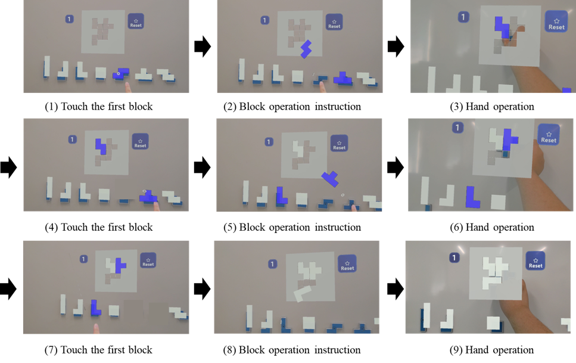
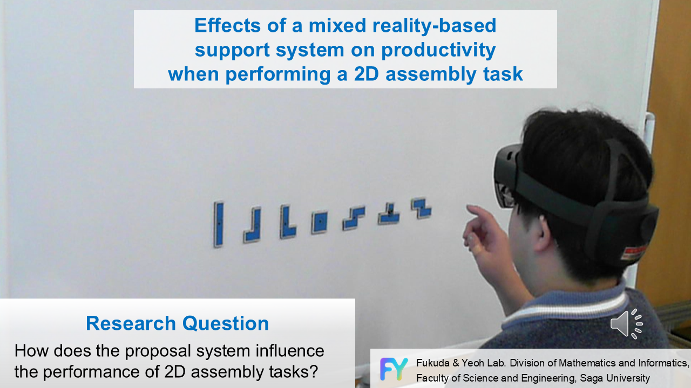

# 研究テーマ **「複合現実を用いた組立作業支援システムが2次元組立作業に及ぼす影響」**

## 概要(Overview)
本研究では、製造業における組立作業の効率向上を目指し、二次元組立作業を対象として複合現実技術を活用している。セル生産方式が主流の組立現場では、複雑な作業において紙の指示書が情報伝達に時間を要し、作業効率低下の課題となっている。そこで、私は複合現実を活用した組立支援システムを提案した。本システムにより、複雑な組立作業においても、部品のホログラムを実際の組立て位置に重ねて表示することで、作業者の理解を容易にすることができる。
　これにより、作業効率の向上に加え、新入社員向けの教育プログラムへの応用による指導コスト削減も期待できる。実際に、テトロミノブロックを用いたシルエットパズル作業での検証では、複合現実によるシステムが作業時間を短縮し、作業者の負担を軽減できることが確認できた 。以上のように、本研究は製造業における組立作業環境の改善と作業者の負担軽減に貢献できると確信しており、積極的に取り組んでいる。

## 作成したシステム(System)
### 動作環境 
- visual studio 2022
- unity ver 2022.3.12f1
- Mixed Reality Feature Tool v1.0.2209.0
- Mixed Reality Toolkit 3 (MRTK3) 
- MRデバイス[Hololens2(Microsoft製)](https://learn.microsoft.com/ja-jp/hololens/)

## デモ動画(Demo)

[YouTubeで見る](https://youtu.be/XVHCudhtdko?si=wegUWTtbsIYSvQMw)

## 学会発表(Conference Presentation)
- [日本人間工学会第66回大会，口頭発表，2025年5月](https://pub.confit.atlas.jp/ja/event/jes66/presentation/3D05-03)

- [SICE Festival with Annual Conference，口頭発表，2025年9月](https://cps.ip.is.saga-u.ac.jp/?p=3768)
